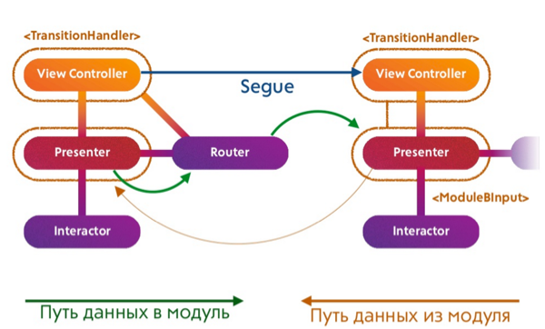

# VIPER-SWIFT
## Example of VIPER implementation in Swift 2

### Tools that REPO uses:
* [ViperMcFlurry](https://github.com/rambler-ios/ViperMcFlurry) (Helepers for creation proper module connections and routing)
* [Generamba](https://github.com/rambler-ios/Generamba) (automatic VIPER module generator) 

